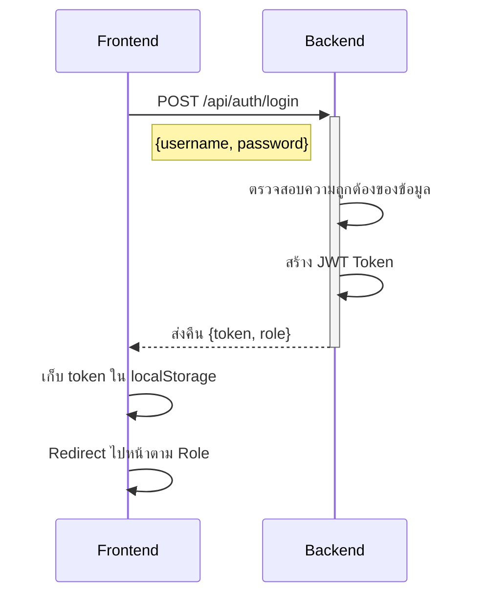
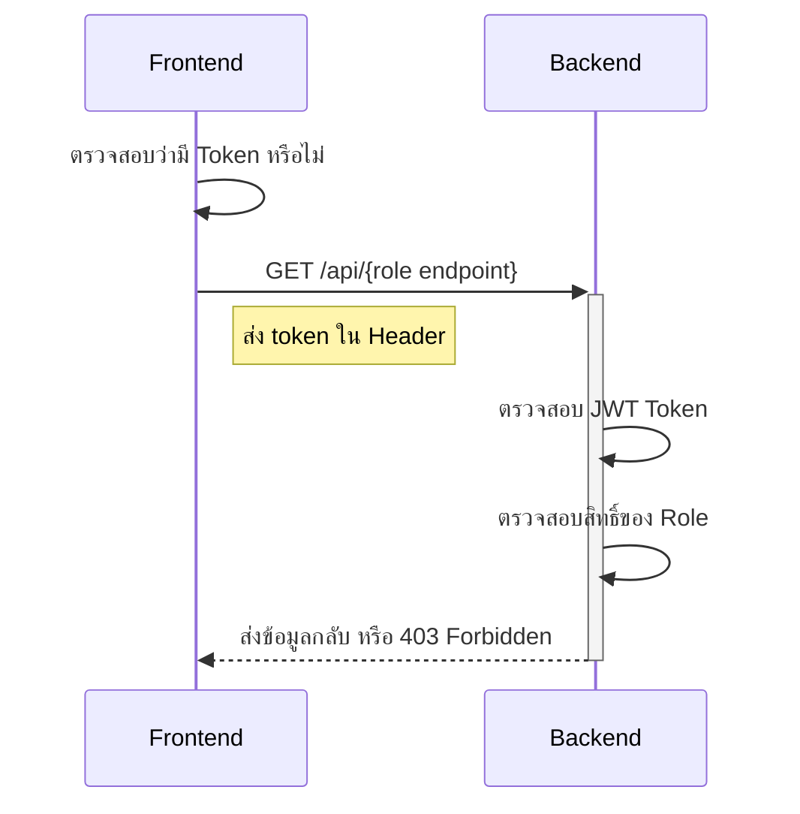

# Authentication Flow Documentation (Next.js + JWT + Role-based Access Control)

## 📌 ภาพรวมของระบบ

โครงการนี้เป็นระบบ **Authentication และ Authorization** ที่รองรับ **Role-based Access Control (RBAC)** โดยมี 3 ระดับสิทธิ์การเข้าถึง:
- **User** → มีสิทธิ์เข้าถึงข้อมูลพื้นฐาน
- **Manager** → มีสิทธิ์จัดการข้อมูลบางส่วน
- **Admin** → มีสิทธิ์ควบคุมระบบทั้งหมด

---

## 🔹 **ขั้นตอนการตรวจสอบสิทธิ์ (Authentication Flow)**

### **1. กระบวนการเข้าสู่ระบบ (Login Process)**


### **2. การเข้าถึงหน้าที่ต้องใช้สิทธิ์ (Protected Route Access)**


---

## 🔹 **API Endpoints ที่ใช้ในระบบ**

### **📌 การยืนยันตัวตน (Authentication API)**
| Method | Endpoint | คำอธิบาย |
|--------|---------|----------|
| `POST` | `/api/auth/login` | ใช้สำหรับเข้าสู่ระบบ |
| `GET` | `/api/auth/sso` | รองรับการเข้าสู่ระบบผ่าน Keycloak SSO |

**📌 ตัวอย่าง Request (`POST /api/auth/login`)**
```json
{
  "username": "user1",
  "password": "password"
}
```
**📌 ตัวอย่าง Response**
```json
{
  "token": "eyJhbGciOiJIUz...",
  "role": "user"
}
```

---

## 🔹 **Frontend Routes (เส้นทางของหน้าเว็บ)**

| Route | คำอธิบาย | ผู้ที่เข้าถึงได้ |
|--------|---------|----------------|
| `/login` | หน้าเข้าสู่ระบบ | ทุกคน |
| `/dashboard` | Dashboard พื้นฐาน | User, Manager, Admin |
| `/manager` | Dashboard ผู้จัดการ | Manager, Admin |
| `/admin` | Dashboard ผู้ดูแลระบบ | Admin เท่านั้น |

---

## 🔹 **รายละเอียดการทำงานของ Authentication**

### **📌 ใช้ `useAuth` Hook สำหรับตรวจสอบสิทธิ์**
```typescript
// ป้องกันหน้าที่ต้องใช้สิทธิ์
useAuth(requiredRole?: string)

// ตัวอย่างการใช้งาน
useAuth("admin") // อนุญาตให้เฉพาะ Admin เท่านั้น
useAuth() // อนุญาตให้ทุกคนที่เข้าสู่ระบบแล้ว
```

### **📌 ใช้ Middleware สำหรับตรวจสอบ Role บน Backend**
```typescript
// ฟังก์ชันตรวจสอบ Role และสิทธิ์ของ API
authorizeRole(allowedRoles: string[], request: NextRequest)
```

---

## 🔹 **การจัดเก็บข้อมูลใน Local Storage**
หลังจากเข้าสู่ระบบสำเร็จ **Frontend** จะเก็บค่าต่อไปนี้ไว้:
| Key | คำอธิบาย |
|------|----------|
| `token` | JWT Token ที่ใช้ยืนยันตัวตน |
| `role` | บทบาทของผู้ใช้ เช่น `"user"`, `"manager"`, `"admin"` |

---

## 🔹 **มาตรการด้านความปลอดภัย (Security Features)**

### **1. JWT Authentication**
✅ **ใช้ JWT สำหรับยืนยันตัวตน**  
✅ **Token มีวันหมดอายุ** (เช่น 1 ชั่วโมง)  
✅ **Token ถูกส่งใน Header (`Authorization: Bearer <token>`)**  

### **2. Role-based Access Control**
✅ **Frontend ป้องกันไม่ให้เข้าถึงหน้าที่ไม่มีสิทธิ์**  
✅ **Backend ตรวจสอบ Role ก่อนให้ข้อมูล**  
✅ **มีลำดับชั้นของสิทธิ์ (Hierarchy)**  

### **3. API Security**
✅ **ทุก API Route ต้องตรวจสอบ JWT Token**  
✅ **Role Validation ในทุกคำขอ**  
✅ **หากไม่มีสิทธิ์ จะส่ง HTTP `403 Forbidden`**  

---

## 🔹 **บัญชีทดสอบสำหรับนักพัฒนา (Dev Credentials)**

สำหรับการทดสอบระบบ สามารถใช้บัญชีต่อไปนี้:

```json
[
  { "username": "user1", "password": "password", "role": "user" },
  { "username": "manager1", "password": "password", "role": "manager" },
  { "username": "admin1", "password": "password", "role": "admin" }
]
```

---

## 🎯 **สรุป**
✅ ระบบรองรับ **Authentication + JWT**  
✅ ระบบรองรับ **Role-based Authorization**  
✅ มีการแยก **สิทธิ์ของ User, Manager และ Admin**  
✅ มีการป้องกัน **API & Frontend Route** ตาม Role  
✅ รองรับ **Keycloak SSO**  

🔥 **ระบบพร้อมใช้งาน และสามารถขยายต่อได้ 🎉**
