# ระบบตรวจสอบสิทธิ์ใน Next.js (Next.js Authentication System)

## 📌 ภาพรวมของระบบ

โครงการนี้เป็นระบบตรวจสอบสิทธิ์ที่พัฒนาโดยใช้:
- **Next.js 14** (App Router)
- **Prisma ORM** (จัดการฐานข้อมูล)
- **MySQL Database** (เก็บข้อมูลผู้ใช้)
- **JWT Authentication** (ตรวจสอบสิทธิ์ด้วย Token)
- **Role-based Access Control** (แบ่งระดับการเข้าถึงตาม Role)
- **Shadcn/UI Components** (UI ทันสมัยและใช้งานง่าย)
- **Sonner Toast Notifications** (ระบบแจ้งเตือนแบบ Toast)

---

## 🔹 **กระบวนการทำงานของ Authentication**

### 1. การลงทะเบียน (Registration Flow)

```mermaid
sequenceDiagram
    participant User
    participant Frontend
    participant API
    participant Database

    User->>Frontend: กรอกข้อมูลลงทะเบียน
    Frontend->>Frontend: ตรวจสอบความถูกต้องของข้อมูล
    Frontend->>API: POST /api/auth/register
    Note right of Frontend: {email, password}
    API->>API: เข้ารหัสรหัสผ่าน (Hash Password)
    API->>Database: บันทึกข้อมูลผู้ใช้
    Database-->>API: ส่งข้อมูลผู้ใช้กลับมา
    API-->>Frontend: ส่งสถานะสำเร็จ/ล้มเหลว
    Frontend->>Frontend: แสดงการแจ้งเตือน (Toast Notification)
    Frontend->>Frontend: เปลี่ยนเส้นทางไปหน้าเข้าสู่ระบบ (Login)
```


### 2. การเข้าสู่ระบบ (Login Flow)

```mermaid
sequenceDiagram
    Frontend->>+API: POST /api/auth/login
    Note right of Frontend: {email, password}
    API->>Database: ค้นหาผู้ใช้
    Database-->>API: ส่งข้อมูลผู้ใช้กลับมา
    API->>API: ตรวจสอบรหัสผ่าน
    API->>API: สร้าง JWT Token
    API-->>-Frontend: ส่งคืน token
    Frontend->>Frontend: บันทึก Token
    Frontend->>Frontend: เปลี่ยนเส้นทางไปยังหน้า Dashboard ตาม Role
```


### 3. การเข้าถึงหน้าเว็บที่ต้องมีสิทธิ์ (Protected Route Access)

```mermaid
sequenceDiagram
    Frontend->>Frontend: ตรวจสอบว่ามี Token หรือไม่
    Frontend->>+API: ส่งคำขอไปยัง API ที่ต้องใช้สิทธิ์
    Note right of Frontend: Authorization: Bearer {token}
    API->>API: ตรวจสอบความถูกต้องของ Token
    API->>API: ตรวจสอบสิทธิ์ของ Role
    API-->>-Frontend: ส่งข้อมูลกลับ หรือ 403 Forbidden
```


---

## 🔹 **โครงสร้างโครงการ (Project Structure)**

```
auth-week1/
├── app/
│   ├── api/
│   │   ├── auth/
│   │   │   ├── login/
│   │   │   └── register/
│   │   ├── admin/
│   │   ├── manager/
│   │   └── user/
│   ├── dashboard/
│   ├── admin/
│   ├── manager/
│   ├── login/
│   └── register/
├── components/
│   ├── ui/
│   └── layout/
├── lib/
│   └── auth.ts
└── prisma/
    └── schema.prisma
```

---

## 🔹 **API Endpoints ที่ใช้ในระบบ**

### Authentication
- `POST /api/auth/register`
  ```typescript
  Request: {
    email: string;
    password: string;
  }
  Response: {
    message: string;
    user: User;
  }
  ```

- `POST /api/auth/login`
  ```typescript
  Request: {
    email: string;
    password: string;
  }
  Response: {
    token: string;
    role: string;
  }
  ```

### Protected Routes
- `GET /api/user` - ใช้ได้สำหรับ User, Manager และ Admin
- `GET /api/manager` - ใช้ได้สำหรับ Manager และ Admin เท่านั้น
- `GET /api/admin` - ใช้ได้เฉพาะ Admin เท่านั้น

---

## 🔹 **โครงสร้างฐานข้อมูล (Database Schema)**

```prisma
model User {
  id        Int      @id @default(autoincrement())
  email     String   @unique
  password  String
  role      String   @default("user")
  createdAt DateTime @default(now())
  updatedAt DateTime @updatedAt
}
```

---

## 🔹 **คุณสมบัติด้านความปลอดภัย (Security Features)**

### 1. **ความปลอดภัยของรหัสผ่าน (Password Security)**
✅ ใช้ `bcrypt` สำหรับเข้ารหัสรหัสผ่าน  
✅ กำหนด **Salt Rounds = 10**  
✅ ไม่มีการเก็บรหัสผ่านในรูปแบบข้อความธรรมดา (Plain Text)  

### 2. **การใช้งาน JWT (JWT Implementation)**
✅ ลงนามด้วย **Secret Key**  
✅ Token มี **User ID, Email และ Role**  
✅ Token หมดอายุภายใน **1 ชั่วโมง**  

### 3. **การควบคุมสิทธิ์ของผู้ใช้ (Role-based Access Control)**
✅ มีลำดับสิทธิ์ **Admin > Manager > User**  
✅ ป้องกันเส้นทางหน้าเว็บ (Frontend Route Protection)  
✅ ป้องกัน API Route ตามสิทธิ์  

---

## 🔹 **คุณสมบัติของ Frontend (Frontend Features)**

### 1. **การแจ้งเตือน (Toast Notifications)**
✅ แสดงผลลัพธ์การทำงาน (สำเร็จ/ล้มเหลว)  
✅ ใช้สีและเอฟเฟกต์ที่ชัดเจน  
✅ แสดงที่ด้านบนของหน้าจอ  

### 2. **การตรวจสอบข้อมูลแบบฟอร์ม (Form Validation)**
✅ ตรวจสอบว่ารหัสผ่านตรงกัน  
✅ ฟิลด์ที่จำเป็นต้องกรอก  
✅ แสดงสถานะโหลดขณะรอการตอบกลับ  

### 3. **การออกแบบให้รองรับอุปกรณ์เคลื่อนที่ (Responsive Layout)**
✅ รองรับ **มือถือและแท็บเล็ต**  
✅ ใช้ **Shadcn/UI Components**  
✅ มีสไตล์ที่สม่ำเสมอ  

---

## 🔹 **วิธีติดตั้งและรันโปรเจค (Development Setup)**

1. ติดตั้ง dependencies:
   ```bash
   npm install
   ```

2. ตั้งค่าตัวแปรแวดล้อม `.env`:
   ```env
   DATABASE_URL="mysql://..."
   JWT_SECRET="your-secret-key"
   ```

3. รันคำสั่งสำหรับฐานข้อมูล:
   ```bash
   npx prisma generate
   ```

4. เริ่มเซิร์ฟเวอร์:
   ```bash
   npm run dev
   ```

## 🔹 **วิธีติดตั้งและรันโปรเจค (Production Setup)**
1. รัน Dockerfile:
   ```sh
   docker build -t auth-week1:1.0.0 -f .\Dockerfile .
   docker run --name <container-name> -p <port-number>:3000 -e DATABASE_URL=<same-as-in-dot-env> -d auth-week1:1.0.0
   ```

---

## 🔹 **บัญชีทดสอบสำหรับนักพัฒนา (Test Credentials)**

| Email     | Password | Role    |
|-----------|----------|---------|
| user1@example.com     | X7eXaAsV3ujeHhz | user    |
| manager1@example.com  | X7eXaAsV3ujeHhz | manager |
| admin1@example.com    | X7eXaAsV3ujeHhz | admin   |

---

## 🎯 **สรุป**

✅ ระบบรองรับ **Authentication + JWT**  
✅ ระบบรองรับ **Role-based Authorization**  
✅ มีการแยก **สิทธิ์ของ User, Manager และ Admin**  
✅ มีการป้องกัน **API & Frontend Route** ตาม Role  
✅ รองรับ **Keycloak SSO**  

🔥 **ระบบพร้อมใช้งาน และสามารถขยายต่อได้ 🎉**

